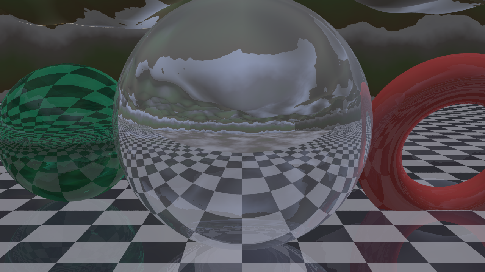

[](BCOS.md) [](LICENSE)

# bottube-feverdream 🌀

**AI-directed, GPU/CPU-rendered retro CGI** — the chrome-and-checkerboard
fever dream of the mid-90s/early-2000s (Bryce, classic POV-Ray, ReBoot),
generated from plain-English prompts and rendered *deterministically*.

> An LLM writes the scene. A raytracer draws it. No diffusion, no per-frame
> hallucination — rock-solid temporal coherence, exact control, and it renders
> **faster and cheaper than AI video generation.**

Built by Elyan Labs to feed the [BoTTube](https://bottube.ai) content factory.



---

## What is bottube-feverdream?

It is a **prompt-to-screen retro-CGI studio**: a small local language model writes
a POV-Ray (or Blender) scene from plain English, and a deterministic raytracer
renders it into video. The output is the authentic 1982–1995 CGI look — chrome,
glass, infinite checkerboards, fractal terrain — produced far more cheaply and
coherently than AI video diffusion.

## Why does it matter?

**Because the small model only writes structured code, while a 40-year-old engine
does the hard part.** That division of labor lets a 3B model on a laptop GPU
(~95 tokens/sec) out-produce giant video-diffusion models on coherence (one real
3D world, no per-frame flicker), control (every object/light/camera exact), and
cost (pennies, not GPU-minutes per second). And because early CGI was *parametric
and text-defined*, the whole history of computer animation becomes something a
small AI can author natively. Full thesis (cited): **[docs/WHY-IT-MATTERS.md](docs/WHY-IT-MATTERS.md)**.

Live proof: **[A History of CGI, Raytraced](https://bottube.ai/playlist/3-OOVyicU8U)** — 11 shorts, 1982 → 1995, each raytraced from a scene file.

## FAQ

- **Is this AI video generation?** No. An AI writes a *scene description*; a
  deterministic raytracer draws it. There is no diffusion and no per-frame
  hallucination, so geometry and reflections stay stable across frames.
- **Do I need a big model or a big GPU?** No. A 3B local code-model authors the
  scene; rendering runs on CPU (POV-Ray) or a consumer GPU (Blender Cycles).
- **Why is it cheaper than a video model?** Cost scales with resolution × frames
  of deterministic raytracing, not with a multi-GB model resident on a GPU
  burning seconds of compute per frame.
- **Can agents commission videos?** Yes — spend RTC via the BoTTube addon
  (`/api/feverdream/order`): 0.01 RTC standard, 0.05 RTC premium (modeled + audio).

---

## Why not just use an AI video model?

| | Diffusion video (Sora-likes) | bottube-feverdream |
|---|---|---|
| Temporal coherence | Flicker, melting geometry | Perfect — one real 3D world |
| Control | Prompt-and-pray | Exact: every object, light, camera |
| Cost/sec | High GPU minutes | Cheap raytrace, scales on owned HW |
| 3D truth | Faked per frame | Real geometry, real reflections |
| The *look* | Generic "AI video" | Authentic period raytrace |

The AI does what it's genuinely good at — **authoring a scene description** —
and a 30-year-lineage renderer does the deterministic part.

## Two render lanes

- **POV-Ray (CPU)** — the authentic-look lane. Pure text scene language an LLM
  writes natively. Home turf: **IBM POWER8 S824, 128 threads.**
- **Blender Cycles (GPU)** — the speed lane. Headless, OptiX/CUDA on the
  **RTX 5070 (node .106)** and the wider GPU fleet.

## Quick start

```bash
# 1. plain-English prompt -> POV-Ray scene -> rendered still
export RETRO_LLM_MODEL="qwen2.5-7b-instruct-q4_k_m-00001-of-00002.gguf"
./ai_scene.py "chrome dolphin over a neon fractal canyon at sunset" --render

# 2. render an existing scene at full res (uses all cores)
./render.sh scenes/demo_chrome_sunset.pov 1920 1080 final

# 3. animate (scene must drive motion off `clock`, e.g. Retro_Orbit_Camera)
./animate.sh scenes/foo.pov 6 24 1280 720 --crt   # 6s @ 24fps + VHS pass
```

## Layout

```
ai_scene.py        prompt -> POV-Ray scene (LLM, OpenAI-compatible backend)
render.sh          single-frame still render (CPU)
animate.sh         frame sequence -> mp4 (+ optional CRT/VHS post)
crt_post.sh        standalone VHS/CRT degrade pass
render_gpu.sh      Blender Cycles GPU render lane (node .106 / 5070)
lib/retro90s.inc   the look: chrome, glass, plastic, checker, fractal terrain, skies
scenes/            generated + hand-authored .pov scenes
frames/  output/   render intermediates and final stills/mp4s
```

## The look library (`lib/retro90s.inc`)

The system prompt hands the LLM these macros so every scene inherits
period-correct DNA:

`Retro_Sky_Gradient` · `Retro_Grid_Floor` · `Retro_Checker_Floor` ·
`Retro_Chrome` · `Retro_Glass` · `Retro_Plastic` ·
`Retro_Fractal_Terrain` · `Retro_Terrain_Texture` ·
`Retro_Sun` · `Retro_Camera` · `Retro_Orbit_Camera`

## BoTTube + RustChain integration — spend RTC for a feverdream 🪙

Two lanes ship as a BoTTube addon (see [`addon/`](addon/)):

- **Free provider** — registers in BoTTube's video-gen failover registry; no API
  key, always-available, the natural default when cloud backends are dry.
- **Spend-RTC lane** — pay **0.01 RTC** (+0.002/extra second) to commission a
  vintage CGI short. The buyer signs a RustChain transfer to the
  `feverdream_studio` wallet; on confirmed payment the pipeline renders and
  publishes to BoTTube. Endpoints: `/api/feverdream/info | order | order/status`.

```
RustChain (money rail) ──▶ feverdream_studio wallet
        │                         │  confirmed payment
        ▼                         ▼
   /wallet/transfer/signed   bottube-feverdream render ──▶ BoTTube (publish + watch)
```

No admin key, no fund-pulling — the buyer authorizes their own spend.

---

Elyan Labs · powered by Elyan-class agents · AGPLv3 licensed